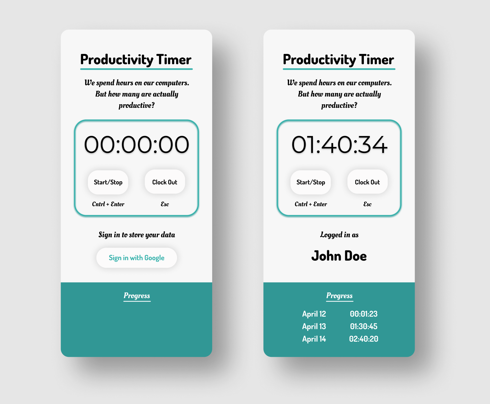

# Productivity Timer

A stopwatch for clocking in and out once we're sitting at our computers to measure how many hours of productive work is actually being done.

## Built with

- Javascript
- [Firebase](https://firebase.google.com/)
- [Tailwindcss](https://tailwindcss.com/)

## Version 2.0

_Coming Soon_

